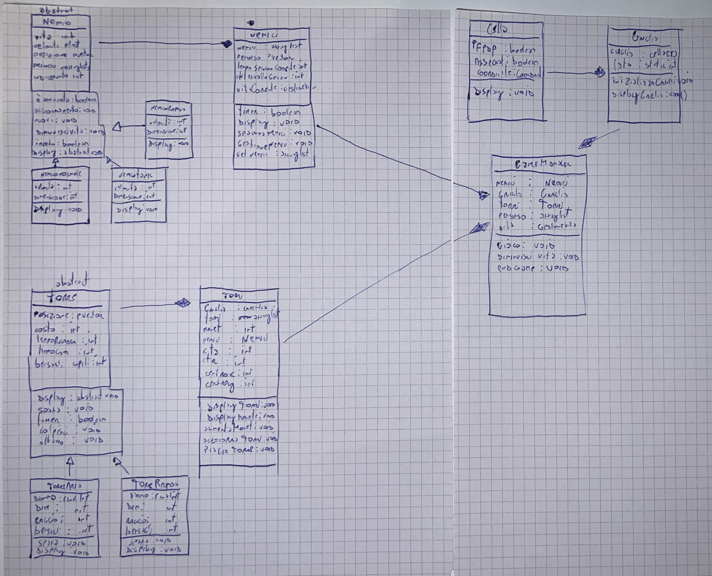

# Progetto tower defense di Zampis Gabriele
Il progetto consiste in un gioco in 2D ispirato ai giochi Tower Defense, ma con una grafica semplificata. L'obiettivo del giocatore è posizionare delle torri lungo un percorso per fermare i nemici prima che raggiungano la fine del tracciato. Se un nemico arriva alla fine, il giocatore perde una vita. Quando tutte e dieci le vite sono esaurite, il gioco mostra la schermata di game over. Ci sono 3 tipi di nemici, il tank, quello veloce, e quello standard, ognuno con caratteristiche differenti:
 nemico tank: più lento ma possiede più vita
 nemico normale: standard, una via di mezzo dei due 
 nemico rapido: molto più veloce ma dispone di meno vita 
## meccanismi di gioco 
il giocatore durante il gioco è tenuto a piazzare delle torri nella cella tramite l'utilizzo del mouse e di uno dei due tasti (1 o 2) per posizionare una delle due torri:
 torre ad area: ha un area e un danno maggiore, ma è molto lenta, costo: 50 monete
 torre rapida: ha un area minore e un danno minore, ma colpisce molto più velocemente, costo: 70 monete 
difficolta
col passare del tempo il gioco diventerà sempre più complesso, e ad una certa sarà impossibile vincere, è presente un moltiplicatore della vita che ogni 10 secondi aumenta di n numero la vita, rendendo ad una certa il gioco impossibilie da vincere
col passare del tempo inoltre vengono generati sempre più nemici, per raggiungere questo spawn massimo bisogna sopravvivere 40 secondi 
## requisiti funzionali 
• I nemici che compaiono in ogni ondata devono essere scelti in modo casuale.
• Il giocatore ha dieci vite. Se più di nove nemici raggiungono la fine del percorso, il gioco termina e compare la scritta "Game Over" in rosso.
• Il giocatore può piazzare un numero illimitato di torri, ma deve acquistarle usando le monete.
• All'inizio del gioco, il giocatore riceve 70 monete per il corretto funzionamento della progressione del gioco.
• Le monete si guadagnano uccidendo i nemici.
• il giocatore deve poter posizionare le torri solamente nelle celle non assegnate e non facenti parte del percorso 
• il giocatore deve avere la possibilità di schierare due tipi di torri, una ad area e una rapida
• il giocatore deve trovarsi nella situazione di affrontare una situazione random di nemici estratti casualmente e progressivamente potenziati nel lungo andare della partita
## requisiti non funzionali
• Il sistema deve essere di facile utilizzo.
• Il sistema deve riuscire a girare anche su ogni tipo di dispotivo .
• Il sistema deve riuscire ad essere veloce e performante nella grafica affinche si possa usufruire di un esperienza corretta di gioco.
• Il sistema non deve essere troppo pesante in termini di memoria, e utilizzo delle risorse in generale della macchina.
• Il sistema deve avere un tempo di risposta veloce.
• il sistema dev'essere facilmente mantenibile e aggiornabile
## scelte progettuali 
per lo sviluppo corretto di un sistema attuo a giocare a questo tower defense sono state applicati i seguenti criteri:
• utilizzo delle classi e del polimorfismo per evitare ridondanza nel codice, permette di risparmiare tempo, e non sovraccaricare con codice non necessario la macchina
• divisione in classi e metodi efficiente, praticamente ogni metodo si occupa di una determinata cosa da fare, e nelle classi viene utilizzato un metodo sommatorio con visibilità public che serve per aggiornare insieme tutte le funzioni, cosi da risultare una sola funziona da aggiornare visibile alle classi in cui quella determinata classe è utilizzata
e utilizzate le seguenti classi: 
• classe per le coordinate
• classe per la cella: contenente il colore, e le coordinate 
• classe per la griglia: attua al disegnamento della griglia durante il gioco 
• classe nemico e tutte le sottoclassi: oggetto nemico, utilizza il polimorfismo, la superclasse è astratta 
• classe nemici: compone tutto l'insieme di nemici e si occupa di generarne e rimuoverne 
• classe delle torri e tutte le sottoclassi: oggetto per difendere la torre, vengono istanziate spendendo monete, possono essere istanziate in una cella non occupata e non facente parte del percorso
• classe del gameManager: come verte nel nome, la classe gameManager si occupa di gestire tutte le impostazioni del gioco.

